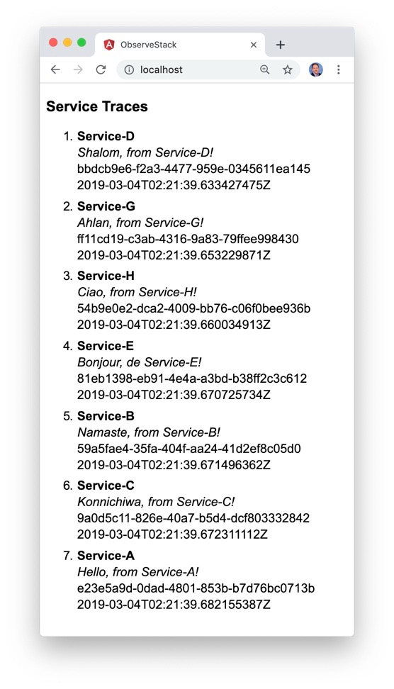

# k8s-istio-observe-frontend

_Project in Progress_

Angular 7 front-end application for [golang-srv-demo](https://github.com/garystafford/golang-srv-demo).


## Misc Commands

```bash
david # update Angular to 5.0.0

ng update @angular/cli --migrate-only --from=5.0.0

yarn install
yarn add typescript@">=3.1.1 and <3.3.0"
ng serve --open

time docker build -t garystafford/angular-observe:1.0.0 . --no-cache
docker run -p 80:80 garystafford/angular-observe:1.0.0

yes | docker system prune
```
