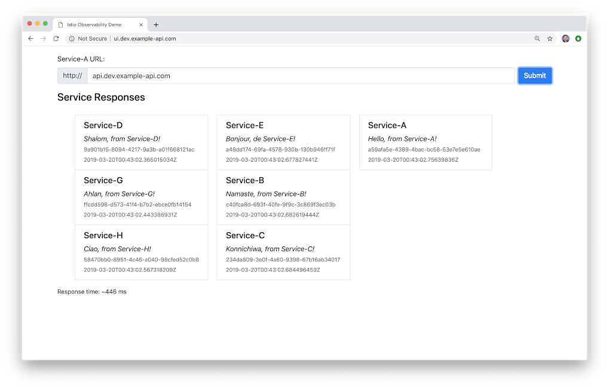

# Go-based Microservices Observability Demo with Istio 1.1.0

**Successfully tested with Istio 1.1.0, released 3/19/2019**

Angular 7 front-end UI application, part of a [reference distributed system platform](https://github.com/garystafford/k8s-istio-observe-backend), which is designed to generate HTTP-based service-to-service, TCP-based service-to-database (MongoDB), and TCP-based service-to-queue-to-service (RabbitMQ) IPC (inter-process communication). Service A calls Service B and Service C, Service B calls Service D and Service E, Service D produces a message on a RabbitMQ queue that Service F consumes and writes to MongoDB, and so on. These distributed communications can be observed using Istio's observability tools, Jaeger, Kiali, Prometheus, and Grafana, when the system is deployed to Kubernetes with Istio.

Refer to the post, [Kubernetes-based Microservice Observability with Istio Service Mesh: Part 1](https://wp.me/p1RD28-6fL) and the GitHub project, [k8s-istio-observe-backend](https://github.com/garystafford/k8s-istio-observe-backend) for more information.



## Run UI Application

```bash
npm install yarn
yarn install
ng serve --open
```
